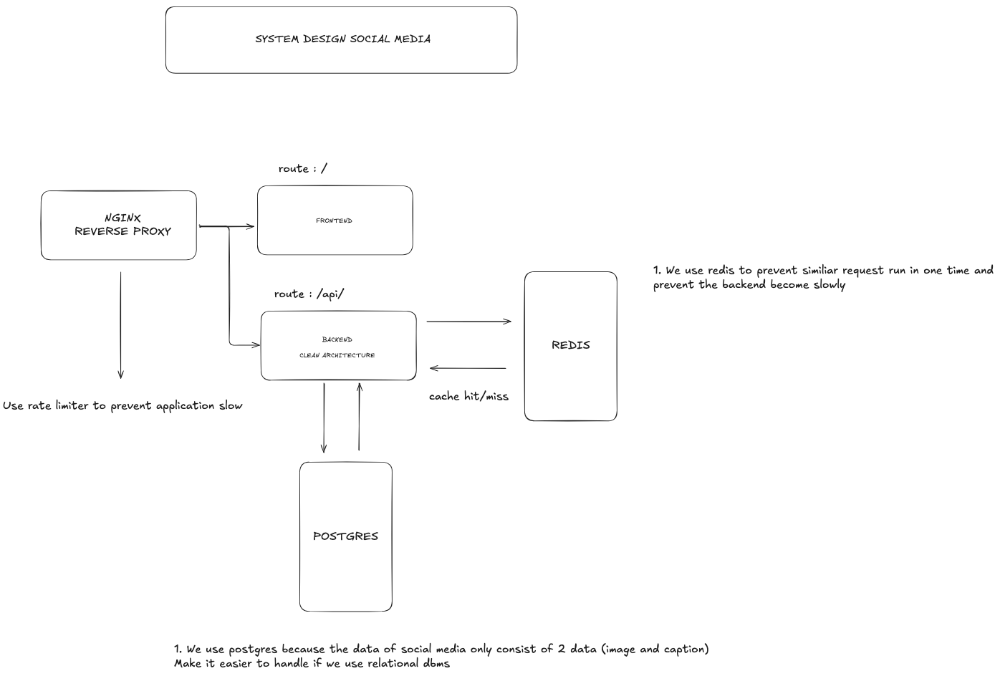
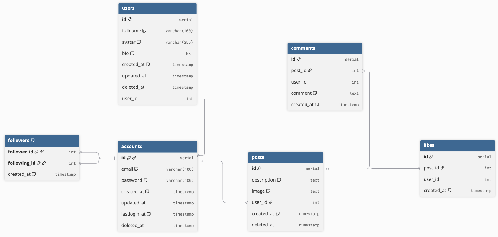

# App Description

### This is backend services for social media, the feature's of this services are:

#### 1. Login

#### 2. Register

#### 3. Logout

#### 4. Update Profile

#### 5. Get User Profile

#### 6. Post Content

### System Design



### ERD



### Project Structure

# Solid Coffee Backend

## 📋 Project Structure

```sh
coffee-morning-services
├── cmd
├── db
│   └── migration
├── docs
├── internal
│   ├── config
│   ├── controller
│   ├── dto
│   ├── middleware
│   ├── model
│   ├── repository
│   ├── response
│   ├── router
│   └── service
├── pkg
│   ├── hash
│   └── jwt
├── public
├── go.mod
├── go.sum
├── Makefile
└── README.md
```
